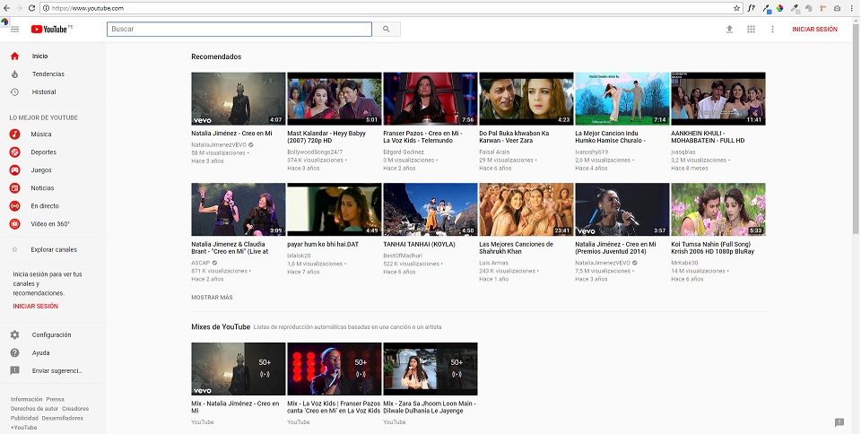
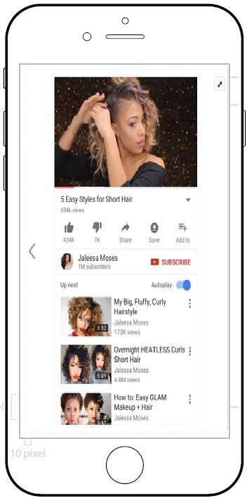

# Retos : UX-UI
* **Track:** _Common Core_
* **Curso:** _Creando un sitio web interactivo con JavaScript_
* **Unidad:** _Intro a User Experience Design_

## Objetivo
Elige una web de tu preferencia y explica qué partes conforman el UX y qué partes el UI.

### Youtube

YouTube es un sitio web dedicado a compartir vídeos. Aloja una variedad de clips de películas, programas de televisión y vídeos musicales, así como contenidos amateur como videoblogs y YouTube Gaming.

#### ¿Qué parte es UX y que parte UI?

Youtube es una página con un buen diseño unido a buena usabilidad.

| UX     | UI    |
| ------ |------:|
| La variedad de opciones para la busqueda, que hace mas sencilla la navegación.  |  Colores de la marca(Rojo, Blanco y Negro). |
| Permite guardar los videos en favoritos de mi cuenta. | Diseño del Logo.  |
| La reproducción automatica. |Boton de Compartir.  |
| Permite Subir videos. | Boton Suscripcion. |
| Canales. | Botones de navegación del video en reproducción (Modo cine,pantalla completa y configuración).  |
| Orden Visual claro. (Se hacia donde dirigirme) | Tipografía del sitio.  |
| Muestra Historial videos. | Menú Principal que me permite tener una navegación Global.  |